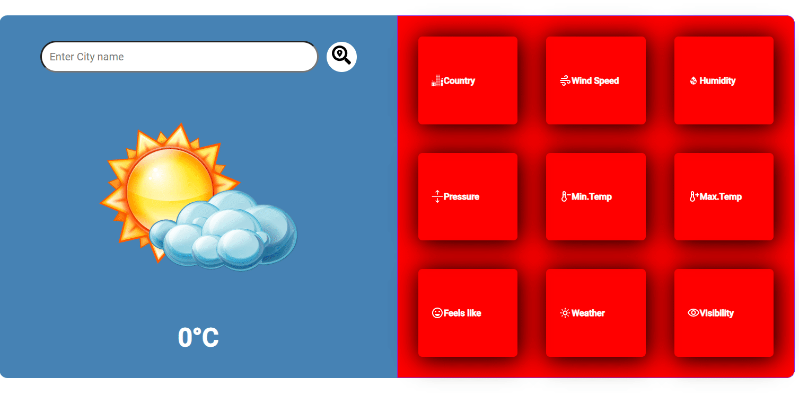

<h1>
Detailed React Weather App

</h1>

My weather application, developed using ReactJS and CSS, provides real-time weather information for a specific location to users. Users can search for a location and instantly view details such as country information, wind speed, humidity, pressure, minimum and maximum temperature throughout the day, perceived temperature, cloud coverage, and visibility. The application offers a user-friendly interface and visually appealing design. It utilizes APIs to fetch accurate and up-to-date weather data, ensuring the reliability of the presented information. With this project, I aim to deliver a seamless weather experience to users, keeping them informed about the current weather conditions in their desired location.

<h1>Used Technologies </h1>
<ul>

<h1>
 Preview 🎥
</h1>

